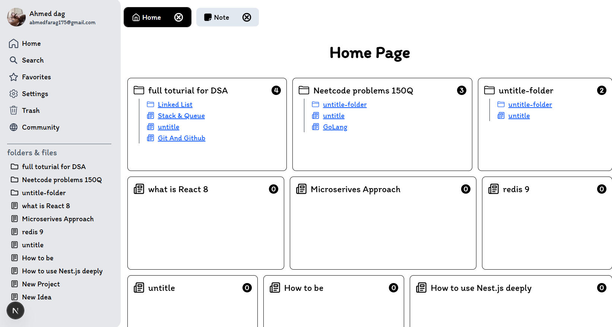
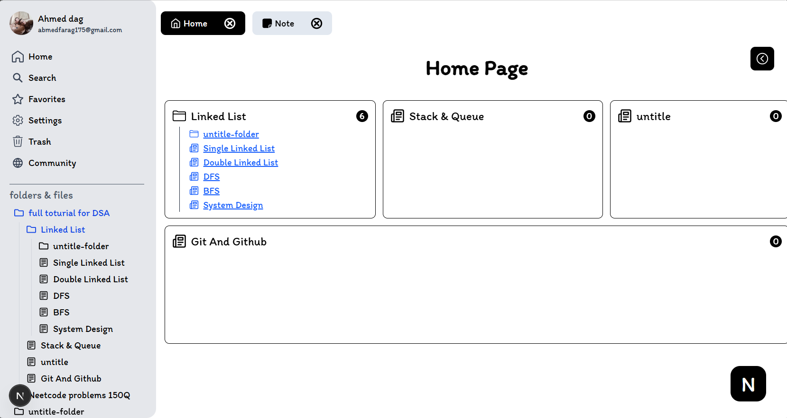
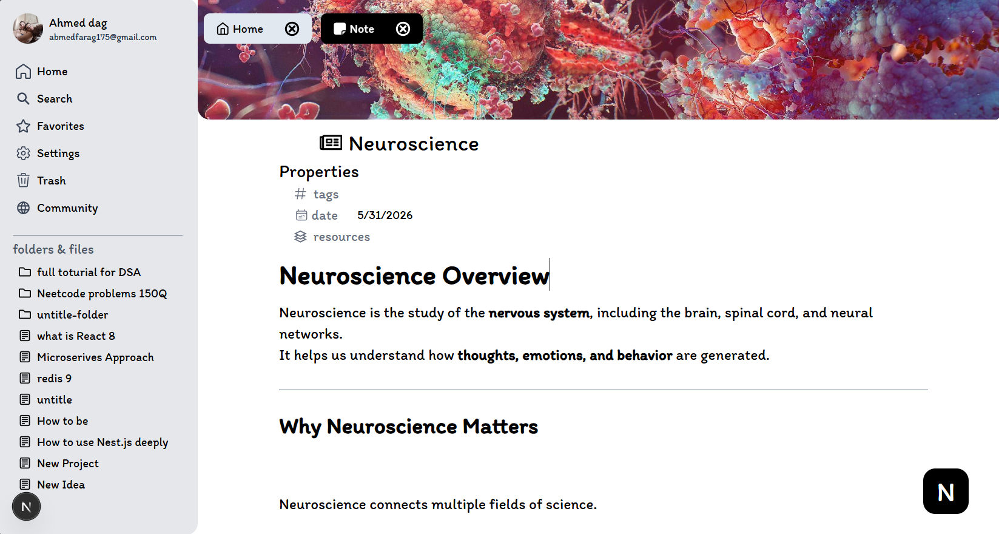

# Notion Clone – Real-time Notes Application

A high-performance, real-time Notion-like collaborative editor built using a modern full-stack TypeScript architecture. This project showcases block-based note editing, live user presence tracking, and flexible monorepo development patterns.

## Screenshots

|                Authentication Page                |                Home Page                |
| :-----------------------------------------------: | :-------------------------------------: |
|  |  |

|              Folder View               |                Note Editor                |
| :------------------------------------: | :---------------------------------------: |
|  |  |

## Technologies

The project is designed with a modern, decoupled, and highly scalable stack:

### Frontend

- **Next.js 16** (App Router) — For static and dynamic routing, optimized rendering, and modular page layouts.
- **React 19** — Core component hierarchy and client-side interactivity.
- **Tailwind CSS 4** — Utility-first styling with modern PostCSS configurations for highly responsive layouts.
- **Axios** — Robust HTTP client for structured interactions with the backend API.
- **React Icons** — Modern vector icons.
- **React Context API** — Light-weight client state management for active nodes, UI themes, and workspace menus.

### Backend

- **NestJS 11** — Progressive Node.js framework for building efficient, testable, and highly structured microservices and APIs.
- **Passport.js** — Secure local credentials (JWT-based) and Google OAuth 2.0 third-party authentication flows.
- **Mongoose** — Elegant MongoDB object modeling for managing users, notes, and block structures.
- **Socket.io / WebSockets** — Bidirectional, low-latency communication layer for real-time collaboration.
- **Swagger API Docs** — Automated API schema generation and sandbox at `/docs` (via `@nestjs/swagger`).

### Database & Cache

- **MongoDB** — Primary document database storing persistent user accounts, note schemas, and content blocks.
- **Redis (ioredis)** — Ultra-fast in-memory cache utilized for live user presence tracking, tracking active connection sockets, and pub/sub events.

### Tooling & Infrastructure

- **Turborepo** — High-performance monorepo build system for caching, dependency resolution, and parallel execution.
- **Docker Compose** — Local container orchestration to run MongoDB and Redis instantly.
- **TypeScript** — Strongly typed contract sharing across client and server.
- **ESLint & Prettier** — Code style checking and automatic code formatting.

---

## Quick Start

Get your local development environment running in under 2 minutes using our automated setup script:

### Prerequisites

- **Node.js** (v18+) & **npm** (v10+)
- **Docker Desktop** (for MongoDB & Redis)

---

### One-Step Setup

```bash
git clone https://github.com/Ahmed-175/Notion-Clone-Nestjs.git
cd Notion-Clone-Nestjs
npm run setup
```

The setup script will:
1.  Initialize all environment files (`.env`, `.env.local`).
2.  Install all project dependencies across the monorepo.

---

### Launch the Application

1.  **Start Databases**:
    ```bash
    docker compose up -d
    ```
2.  **Configure Environment** (Optional):
    Edit `apps/backend/.env` if you need to set your `GOOGLE_CLIENT_ID` or custom secrets.
3.  **Run Development Servers**:
    ```bash
    npm run dev
    ```

- **Frontend**: [http://localhost:3000](http://localhost:3000)
- **Backend API**: [http://localhost:8000](http://localhost:8000)
- **API Documentation**: [http://localhost:8000/docs](http://localhost:8000/docs)

---

### Production Build

To build static bundles and transpile NestJS code:

```bash
npm run build
```

---

## Project Structure

This monorepo uses **Turborepo** to structure and manage dependencies between apps and packages:

```
Notion-Clone/
├── apps/
│   ├── frontend/         # Next.js 16 Web application (Client)
│   └── backend/          # NestJS 11 Web API & Websocket Server (Server)
├── packages/
│   ├── ui/               # Shared React UI component library (@repo/ui)
│   ├── eslint-config/    # Shared lint configurations (@repo/eslint-config)
│   └── typescript-config/# Shared TS configuration guidelines (@repo/typescript-config)
├── docs/                 # Documentation, PRDs, and asset templates
├── scripts/              # Workspace initialization and setup automation scripts
├── docker-compose.yml    # Database containers configuration (Mongo + Redis)
├── package.json          # Monorepo configuration and workspace actions
└── turbo.json            # Turborepo build caching definitions
```

## Contribution Guidelines

We welcome contributions! Please follow these rules to ensure high-quality and consistent code.
